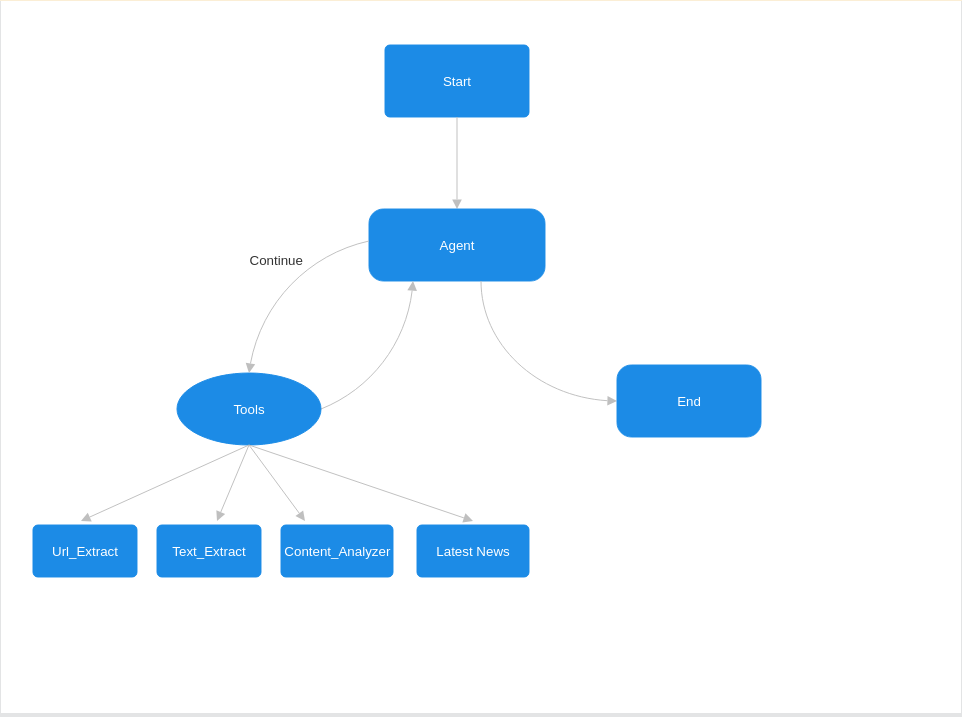

# Web Research Agent Assignment

A Streamlit-based intelligent research assistant that leverages LangChain, Google Search, and LLMs to gather, extract, and analyze web content.
The agent performs a multi-step process: extracting URLs, scraping content, analyzing relevance and reliability, and optionally fetching the latest news.
Designed for users who want quick, summarized, and trustworthy insights from the web in a chat-like interface.


# How Agent works ?



# How to setup ?

1. Clone the Project repo.

```bash
git clone <project_repo_link.git>
```

2. Open the Project folder.

```bash
cd "project_repo_name"
```

3. Install the Dependencies.

```bash
pip install -r requirements.txt
```

4. Run the project.

```bash
python main.py
```
